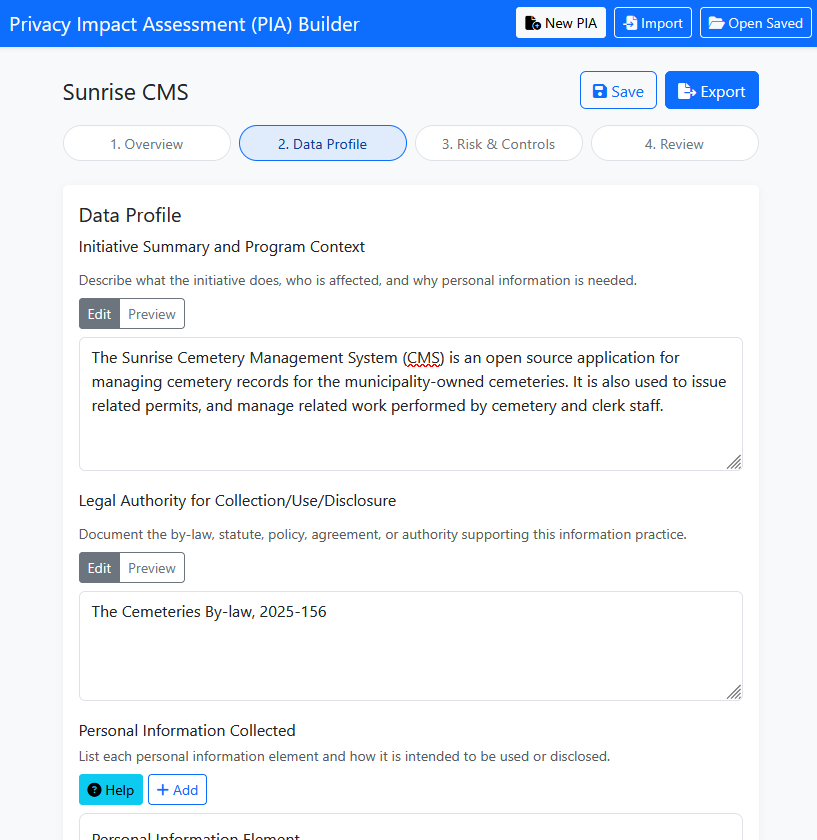

# Privacy Impact Assessment (PIA) Builder

🚧 **Under Development** 🚧

A tool to assist with building Privacy Impact Assessment documents (PIAs), as
required under the
[Municipal Freedom of Information and Protection of Privacy Act (MFIPPA)](https://www.ontario.ca/laws/statute/90m56).

🔗 [**Try the PIA Builder**](https://cityssm.github.io/pia-builder)

⚠️ **Note that this project is not a substitute to review by legal counsel.**

## Features

- 🔐 **Privacy focused.** All form data stays on your computer.
- 📄 **Export options** including JSON, Markdown, and Microsoft Word.
- 💾 **Saved progress** kept locally in your browser, or downloaded to a file
  for reimporting.

## Project Background

The Information and Privacy Commissioner (IPC) of Ontario has expanded its requirements
for Privacy Impact Assessments (PIAs) to include municipalities, effective
January 1st, 2027.

[According to information released by the IPC](https://www.ipc.on.ca/en/resources/fippa-mfippa-updates),
a PIA must include the following:

> - The purpose for collecting, using or disclosing personal information and an
>   explanation of why the personal information is necessary to achieve that purpose.
> - The legal authority that the institution is relying on to collect, use or
>   disclose the personal information.
> - The types of personal information to be collected and, for each type, how
>   it's intended to be used or disclosed.
> - The sources of the personal information to be collected.
> - The position titles of the institution's officers, employees, consultants or
>   agents who will have access to the personal information.
> - Any limitations or restrictions imposed on the collection, use or disclosure
>   of the personal information.
> - The period of time that the personal information will be retained by the institution.
> - An explanation of the administrative, technical and physical safeguards that
>   will be used to protect the personal information and a summary of any risks
>   to individuals in the event of a theft, loss or unauthorized use or
>   disclosure of the personal information.
> - The steps to be taken by the institution to prevent or reduce the likelihood
>   of a theft, loss or unauthorized use or disclosure of personal information
>   and to mitigate risks to individuals.
> - Any other prescribed information.

This project attempts to help a user gather the information required in a PIA.

## Links

- [Planning for Success: Privacy Impact Assessment Guide for Ontario’s public institutions](https://www.ipc.on.ca/en/resources/planning-success-privacy-impact-assessment-guide-ontarios-public-institutions)
